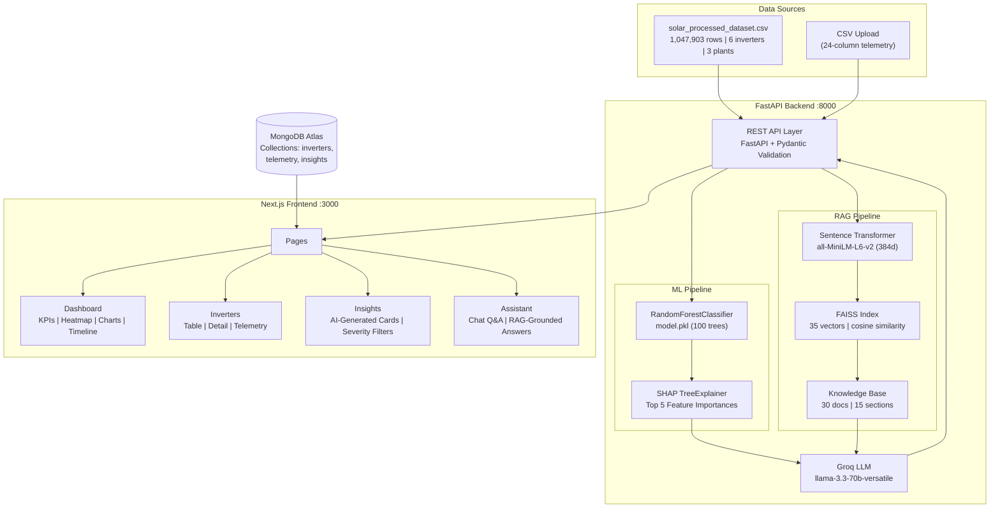
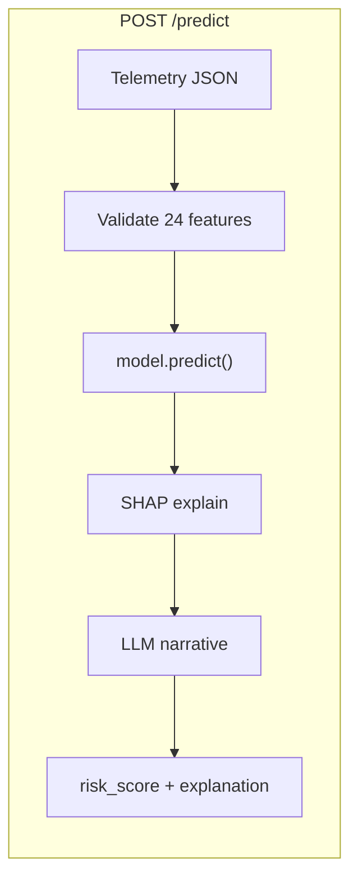
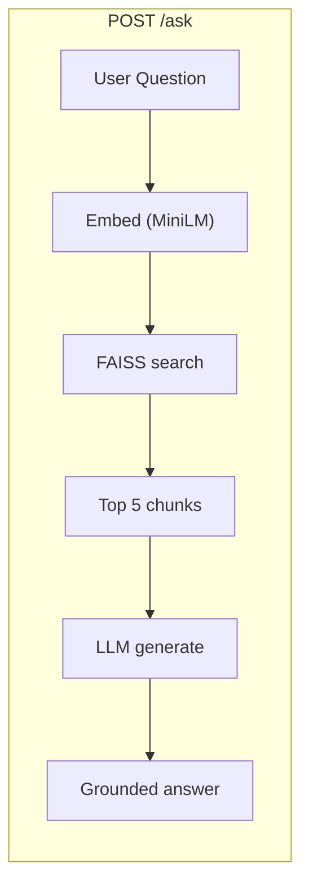
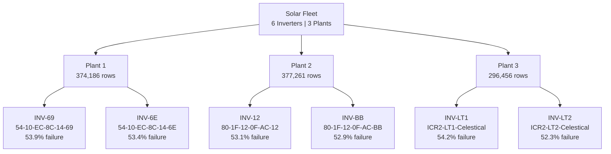
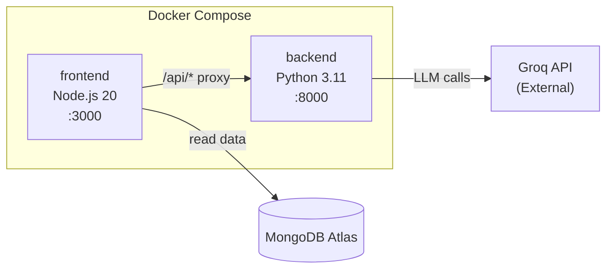

# Sunlytix — System Architecture

## High-Level Architecture

```mermaid
flowchart TB
    subgraph "Data Sources"
        DS1["solar_processed_dataset.csv<br/>1,047,903 rows | 6 inverters | 3 plants"]
        DS2["CSV Upload<br/>(24-column telemetry)"]
    end

    subgraph "FastAPI Backend :8000"
        direction TB
        API["REST API Layer<br/>FastAPI + Pydantic Validation"]
        
        subgraph "ML Pipeline"
            ML["RandomForestClassifier<br/>model.pkl (100 trees)"]
            SHAP["SHAP TreeExplainer<br/>Top 5 Feature Importances"]
        end
        
        subgraph "RAG Pipeline"
            EMB["Sentence Transformer<br/>all-MiniLM-L6-v2 (384d)"]
            FAISS["FAISS Index<br/>35 vectors | cosine similarity"]
            KB["Knowledge Base<br/>30 docs | 15 sections"]
        end
        
        LLM["Groq LLM<br/>llama-3.3-70b-versatile"]
    end

    subgraph "Next.js Frontend :3000"
        direction TB
        PAGES["Pages"]
        DASH["Dashboard<br/>KPIs | Heatmap | Charts | Timeline"]
        INV["Inverters<br/>Table | Detail | Telemetry"]
        INS["Insights<br/>AI-Generated Cards | Severity Filters"]
        AST["Assistant<br/>Chat Q&A | RAG-Grounded Answers"]
    end

    DB[("MongoDB Atlas<br/>Collections: inverters,<br/>telemetry, insights")]

    DS1 --> API
    DS2 --> API
    API --> ML
    ML --> SHAP
    SHAP --> LLM
    API --> EMB
    EMB --> FAISS
    FAISS --> KB
    KB --> LLM
    LLM --> API
    API --> PAGES
    PAGES --> DASH
    PAGES --> INV
    PAGES --> INS
    PAGES --> AST
    DB --> PAGES
```

## Endpoint Flow

```mermaid
flowchart LR
    subgraph "POST /predict"
        P1["Telemetry JSON"] --> P2["Validate 24 features"]
        P2 --> P3["model.predict()"]
        P3 --> P4["SHAP explain"]
        P4 --> P5["LLM narrative"]
        P5 --> P6["risk_score + explanation"]
    end
```

```mermaid
flowchart LR
    subgraph "POST /ask"
        A1["User Question"] --> A2["Embed (MiniLM)"]
        A2 --> A3["FAISS search"]
        A3 --> A4["Top 5 chunks"]
        A4 --> A5["LLM generate"]
        A5 --> A6["Grounded answer"]
    end
```

## Plant-Inverter Mapping

```mermaid
graph TD
    F["Solar Fleet<br/>6 Inverters | 3 Plants"]
    
    P1["Plant 1<br/>374,186 rows"]
    P2["Plant 2<br/>377,261 rows"]
    P3["Plant 3<br/>296,456 rows"]
    
    I1["INV-69<br/>54-10-EC-8C-14-69<br/>53.9% failure"]
    I2["INV-6E<br/>54-10-EC-8C-14-6E<br/>53.4% failure"]
    I3["INV-12<br/>80-1F-12-0F-AC-12<br/>53.1% failure"]
    I4["INV-BB<br/>80-1F-12-0F-AC-BB<br/>52.9% failure"]
    I5["INV-LT1<br/>ICR2-LT1-Celestical<br/>54.2% failure"]
    I6["INV-LT2<br/>ICR2-LT2-Celestical<br/>52.3% failure"]
    
    F --> P1
    F --> P2
    F --> P3
    P1 --> I1
    P1 --> I2
    P2 --> I3
    P2 --> I4
    P3 --> I5
    P3 --> I6
```

## Deployment Architecture

```mermaid
flowchart LR
    subgraph "Docker Compose"
        BE["backend<br/>Python 3.11<br/>:8000"]
        FE["frontend<br/>Node.js 20<br/>:3000"]
    end
    
    MDB[("MongoDB Atlas")]
    GROQ["Groq API<br/>(External)"]
    
    FE -->|"/api/* proxy"| BE
    FE -->|"read data"| MDB
    BE -->|"LLM calls"| GROQ
```
